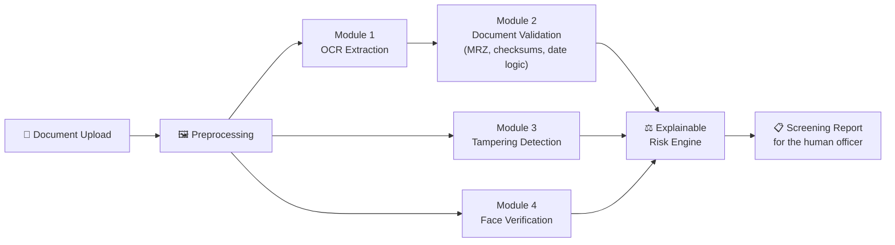

<div align="center">

# 🛂 AI-Based Fake Identity & Document Screening System

### Faster, smarter, explainable document screening for border checkpoints.

*OCR · Document Validation · Tampering Detection · Face Verification · Explainable Risk Scoring*


**Project Expo · Problem Statement ID 26188**

</div>

---

## 📌 Table of Contents

- [The Problem](#-the-problem)
- [Our Solution](#-our-solution)
- [How It Works](#-how-it-works)
- [The Four Modules](#-the-four-modules)
- [Explainable Risk Scoring](#-explainable-risk-scoring)
- [Responsible AI by Design](#-responsible-ai-by-design)
- [Tech Stack](#-tech-stack)
- [Project Structure](#-project-structure)
- [Getting Started](#-getting-started)
- [API Overview](#-api-overview)
- [Project Status & Roadmap](#-project-status--roadmap)
- [Known Limitations](#-known-limitations)
- [Team](#-team)
- [License](#-license)

---

## 🚨 The Problem

Border checkpoints process thousands of identity documents every day: passports, visas, national ID cards, permits and travel authorisations. Verification still leans heavily on **human inspection and basic database lookups**, which means:

| Challenge | Why it hurts |
|---|---|
| Fake passports and visas | Sophisticated forgeries pass a quick visual check |
| Altered photographs | Photo replacement is hard to spot by eye |
| Modified dates of birth | Small text edits change a person's entire record |
| Tampered visa stamps | Forged or edited stamps look convincing at a glance |
| Identity impersonation | The document is real, the person holding it is not |
| Expired or blacklisted documents | Easy to miss under time pressure |
| High passenger volume | Queues force officers to rush, and rushing causes errors |

Manual verification is slow, inconsistent between officers, and leaves no structured trail for later investigation.

## 💡 Our Solution

**An AI-powered screening platform that reads a travel or identity document in seconds, checks it from four independent angles, and hands the officer a clear, explainable risk assessment.**

It is built to **assist border security personnel, not replace them**. The system does the tedious, error-prone work: extraction, cross-checking, forensic analysis. The officer keeps the final decision, with the evidence laid out in front of them.

**What you get**

- ⚡ **Speed:** turns a several-minute manual check into an automated pipeline that runs in seconds
- 🔍 **Depth:** validation rules, forensic tampering heuristics and face verification working together
- 🧾 **Explainability:** every risk score comes with the reasons behind it
- 📏 **Consistency:** the same checks applied the same way at every checkpoint
- 🗂️ **A digital trail:** structured screening reports for investigations and intelligence analysis

## 🧭 How It Works



1. An officer uploads a document image.
2. The image is preprocessed and the OCR module extracts the fields, each with a **confidence score**.
3. The extracted data is validated against document standards, including MRZ parsing, checksum verification and cross-checks between the visual text and the machine-readable zone.
4. In parallel, the image is analysed for signs of tampering and the holder's face is verified.
5. All signals feed one risk engine that outputs a **risk score plus the reasons behind it**, packaged as a screening report.

<!-- TODO (team): add a demo GIF or screenshots here, e.g.

-->

## 🧩 The Four Modules

### 1️⃣ Module 1: OCR Extraction
Automatically reads the relevant fields from identity documents using **PaddleOCR**, after an image preprocessing step to clean up uploads.

- Extracts **name, passport number, date of birth, and issue / expiry dates** <!-- TODO: confirm whether nationality and gender are extracted (e.g. via MRZ) and list them -->
- Attaches a **confidence score** to extracted fields so low-quality reads are flagged instead of silently trusted
- Exposed through a FastAPI endpoint

### 2️⃣ Module 2: Document Validation
Checks whether the extracted information actually follows official document standards.

- **Field presence and format validation**: are the required fields there, and shaped correctly?
- **Date logic**: expired documents, future dates of birth, and other impossible timelines
- **MRZ parsing and checksum verification**: the machine-readable zone carries check digits, so altered values stop adding up
- **Cross-field consistency**: does the printed (visual) data match the MRZ?

### 3️⃣ Module 3: Tampering Detection *(core AI innovation)*
Detects digitally or physically altered documents using **classical image-forensics heuristics**, chosen because they are lightweight, interpretable and don't depend on scarce labelled forgery data.

| Use case | What we look for |
|---|---|
| Photo replacement | Inconsistencies around and within the photo region |
| Text manipulation | Local irregularities where characters were edited |
| Stamp forgery | Anomalies in stamp regions |
| Image metadata analysis | Editing-software traces and suspicious file metadata |

<!-- TODO (team): replace the right-hand column with the exact techniques implemented (e.g. Error Level Analysis, noise/compression inconsistency, copy-move detection, EXIF checks) so the README matches the code precisely. -->

### 4️⃣ Module 4: Face Verification
Confirms that the document owner matches the person presented, catching **identity impersonation**. Developed and tested using **only consented or synthetic data**.

## ⚖️ Explainable Risk Scoring

Rather than a black-box "fake / genuine" verdict, the risk engine **combines signals from every module into a single risk score and shows its working**: which checks passed, which raised flags, and how much each contributed.

This matters because:

- Officers can **trust and challenge** the result instead of blindly following it
- Decisions become **standardised** across checkpoints
- Each screening produces an **auditable report** that supports later investigation

**Illustrative report structure** *(example only, not real data)*

```json
{
  "document_type": "passport",
  "extracted_fields": {
    "name": "…",
    "passport_number": "…",
    "date_of_birth": "…",
    "date_of_expiry": "…"
  },
  "validation": {
    "mrz_checksums": "pass",
    "visual_vs_mrz_consistency": "flag",
    "date_logic": "pass"
  },
  "tampering": { "flags": ["…"] },
  "face_verification": { "match": true },
  "risk": {
    "score": 0.0,
    "reasons": ["…"],
    "recommendation": "refer to officer for manual review"
  }
}
```

## 🛡️ Responsible AI by Design

Identity screening touches real people's lives, so we made deliberate choices:

- **Human in the loop.** The system produces decision *support*. A trained officer makes the call.
- **Explainable by default.** No unexplained scores.
- **Privacy-conscious development.** Face verification was built and tested with **consented / synthetic data only**. No real travellers' documents are used or included in this repository.
- **Honest about limits.** AI / synthetic-generation detection was investigated but deliberately **not integrated**, because reliable validation would need additional real-world datasets and proper experimental evaluation. We would rather ship fewer claims we can stand behind.

## 🛠️ Tech Stack

| Layer | Technology |
|---|---|
| **Backend API** | Python, FastAPI |
| **OCR** | PaddleOCR |
| **Validation** | MRZ parsing, checksum and date-logic rules |
| **Tampering analysis** | Classical image-forensics heuristics |
| **Face verification** | Face verification pipeline (consented / synthetic data) |
| **Frontend** | React + Vite |
| **Testing** | Automated tests (in progress) |

## 📁 Project Structure

```
AI-Document-Screening/
├── backend/           # FastAPI service: OCR, validation, tampering, face, risk engine
├── frontend/          # React + Vite web interface
├── models/            # Model assets used by the pipeline
├── datasets/          # Sample / synthetic data for development and testing
├── scripts/           # Helper and utility scripts
├── tests/             # Automated tests
├── docs/              # Additional documentation
├── uploads/           # Runtime document uploads (not tracked with real data)
├── PROJECT_STATUS.md  # Detailed progress checklist
├── LICENSE            # MIT
└── README.md
```

## 🚀 Getting Started

> **Prerequisites:** Python 3.9+, Node.js 18+ and npm.

**1. Clone the repository**

```bash
git clone https://github.com/sengarom/AI-Document-Screening.git
cd AI-Document-Screening
```

**2. Run the backend**

```bash
cd backend
python -m venv venv
source venv/bin/activate        # Windows: venv\Scripts\activate
pip install -r requirements.txt
uvicorn main:app --reload
```

The API will be available at `http://localhost:8000`, with interactive Swagger docs at `http://localhost:8000/docs`.

**3. Run the frontend**

```bash
cd frontend
npm install
npm run dev
```

<!-- TODO (team): confirm the exact commands (requirements file location, uvicorn entrypoint such as app.main:app, ports, and any model download step). -->

## 🔌 API Overview

The backend exposes REST endpoints for the pipeline stages. Browse and try them live in the auto-generated docs at **`/docs`** once the server is running.

| Capability | Description |
|---|---|
| Health check | Confirms the service is up |
| Document upload and OCR | Upload an image, get extracted fields with confidence scores |
| Validation | Run format, date, MRZ and checksum checks on extracted data |
| Screening report | Combined tampering, face and risk assessment |

<!-- TODO (team): replace with the real route list (method + path) from the FastAPI app. -->

## 📈 Project Status & Roadmap

**Delivered**

- [x] Repository scaffold, FastAPI service with health endpoint, React/Vite frontend scaffold
- [x] Document upload and image preprocessing
- [x] PaddleOCR integration with field extraction and confidence scores
- [x] Document validation: field presence and format, date logic, MRZ parsing and checksums, visual-vs-MRZ cross-checks, validation API endpoint
- [x] Tampering detection using classical heuristics
- [x] Face verification (consented / synthetic data only)
- [x] Explainable risk scoring and screening report

**In progress**

- [ ] Document type detection
- [ ] React dashboard
- [ ] Automated tests and deployment documentation

**Future work**

- [ ] Extend extraction to visas, national IDs, driving licences and permits
- [ ] Database and blacklist integration, including cross-checking for multiple identities used by one person
- [ ] AI / synthetic-generation detection, pending real-world datasets and proper evaluation
- [ ] Batch and high-throughput processing for peak passenger volumes

See [`PROJECT_STATUS.md`](PROJECT_STATUS.md) for the live checklist.

## ⚠️ Known Limitations

- This is a **project expo prototype**, not a certified border-control product.
- Classical tampering heuristics can raise **false positives** on low-quality scans and miss high-end forgeries, which is why the output is a *risk signal for human review*, not an automatic accept / reject.
- OCR accuracy depends on image quality, lighting and document layout.
- Face verification has been evaluated only on consented / synthetic data.

## 👥 Team

Five people, five distinct responsibilities, one pipeline. A screening system is only as strong as its weakest link, so every part of it has a dedicated owner.

| | Member | Role | What they own |
|:-:|---|---|---|
| ⚙️ | **Om Sengar** | Backend Lead | The engine room: the FastAPI service that powers OCR, screening and explainable risk scoring |
| 🖥️ | **Kushaan Aggarwal** | Frontend Lead | The officer-facing React + Vite interface, where results turn into decisions |
| 🎨 | **Shreya Mishra** | Visual Design & Presentation Lead | The face and the voice of the project: visual identity, diagrams, demo storyline and expo presentation. She makes a complex multi-module AI pipeline understandable at a glance to judges, officers and users alike |
| ✅ | **Yashika Dagar** | Validation Lead | Module 2: document validation, covering format rules, date logic, MRZ parsing and checksum checks |
| 🧪 | **Rajveer Singh** | Testing & Quality Lead | Test coverage and reliability, so the system behaves the same way every time it's used |

> 💬 *Great technology that nobody can understand doesn't win, and doesn't get adopted. Clear visuals and a clear story are what carry a technical system from a repository to real-world impact.*

## 📄 License

Distributed under the **MIT License**. See [`LICENSE`](LICENSE) for details.

---

<div align="center">

**Built for the Project Expo · Problem Statement 26188**

*Helping officers make faster, fairer and better-informed decisions.*

</div>
